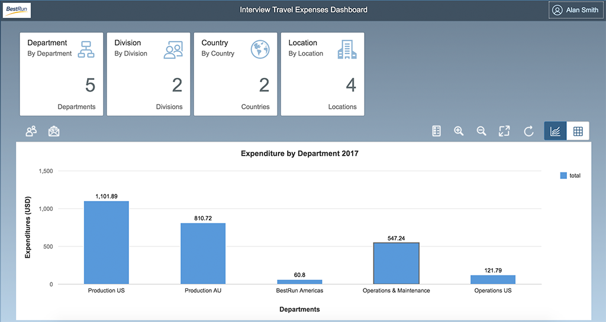

# Introduction

The dashboard is the front end to the implementation of this business process. It shows the various categories summarized by number and total. We have a tile for each category that when clicked shows a breakdown of the various costs by that dimension.

 
 
 Please note that the dashboard will by default return the cached values unless the refresh button on the right is pressed
 
 
 
 When refresh is pressed this will initiate a call to the backend to execute the refresh command that will make the calls to the SAP API Hub to contact SuccessFactors and Concur to rebuild the expenses table.
 
 Consult the services implementation document for more information on the actual implementation and how the data is obtained, managed and manipulated from the SAP API Hub.
 
 
# SAPUI5

The application itself is built using SAPUI5 and is based around the Analytical List View. Due to the complexity of implementing the Analytical List View for scenarios that are not oData based it was decided to implement a view that provides very similar functionality but consumes JSON via a REST interface.

The application was created from the standard SAPUI5 Application Template with the views and the model customized.


# The Views

There are three views within the project that have been used. The two minor views are the reports and users views. These are accessed from the dashboard and are simple enough not to warrant any additional deep dive, suffice to say that like the dashboard they consume data from the expenses global SAPUI5 JSON model. The primary view is the dashboard view that encompasses a set of tiles, together with a chart and a table for the data. All of these controls are bound to the JSON model.


# JSON Model and Data Binding

All access to the data from the service in the application is via the JSON model thus the model is a critical component for obtaining the data. The controls in the application all bind to this model. We instantiate the model in the Component.js but do the loading of the data in the view because this will allow the UI to load and give some feedback to the user. 

The model itself has a load method that does the actual load. This makes a series of asynchronous requests to get all the data from the backend via HTTP calls. This is done in the _loadData method. Once all the calls to the backend have completed the data is loaded into the model the SAPUI5 runtime will take over and the bindings will update the user interface automatically. 

The last point to note in the model is that there is a refresh method. When called this method triggers a refresh on the backend that does the actual loading from the SAP API hub and populates the data in the service. In the model after the refresh completes successfully the data is reloaded from the service and the UI will be updated through the SAPUI5 data binding mechanism.


# Running the Dashboard

The application can be run locally or pushed to cloud foundry. To make testing easier the webapp can be hosted locally and then it can be easily debugged without the need to deploy each time to Cloud Foundry


Before running the web server you will need to open the ExpensesModel.js file in the model folder and change the CLOUD_FOUNDRY_API_ENDPOINT variable to point to your service that is either running locally or is running on cloud foundry. It is important that the correct URL that is used to access the service is setup so the model can load the data.

## Running Locally

To run the package locally, a web server needs to be installed. In this case there are a number of excellent ones available on NPMJS.com. For this exercise the [http-server](https://www.npmjs.com/package/http-server) project is used as this is a zero configuration server that will serve web content with the minimum of fuss. Change to the dashboard folder and run the http-server application. For deployment to Cloud Foundry Nginx is used as the web server and for deployment to Docker the httpd module is used. This give a flavour of the web servers that the dashboard can be run under as the content that needs to be delivered is static content, requiring no server side changes.


This will start the server, so now power up your browser and access the web server but append the webapp path so that the SAPUI5 application will load.


## Running on Cloud Foundry

Running the application from cloud foundry is normally done when the service is created in cloud foundry through the 

```
cf push
```

command as this pushes the service and the dashboard in one operation. After deploying the application to cloud foundry, open the SAP Cloud Platform Cockpit and go to your default space where the two services can be found. Open the *concur-sfsf-web* application and make a note of the URL. Append */webapp* to the URL to access the cockpit.
 

## Completing the exercise
The application should now start and load the data from the backend. Experiment by using the reports and users icons on the left of the toolbar and by using the Refresh button to reload the data from the SAP API Hub and into the model. Finally select the tiles and also the view and chart to see the different formats.

